# 信息学奥赛笔记20-2 初赛知识点

初赛知识点


## 0.0 数据结构

数据结构，是一种计算机存储，储存数据的方式，对于求解同一个问题，选用不同的数据结构，可能会带来不同的运算效率或存储效率。

对于数据的操作，我们一般分为四大类：增、删、查、改，也就是新增，删除，查找，和修改，对于一个数据结构来说，它总有一个侧重的方向，比如说我们想要使用本子来记东西，那么在翻阅查找的时候就会非常方便，本子为我们预留了很多空白页，所以新增一个新的数据也很方便，但是对于删除和修改来说，我们可能需要涂抹，撕裂本子才能够做到，对于数据的存储效率来说就容易受损，所以用本子记笔记的这种存储数据的结构是更倾向于增、查，而不是删、改。

如常用的**数组**也是一种数据结构，我们把相同类型的数据抽象成一个**集合**，被称为**数组**存储在一起，我们通过下标，索引的方式来访问这个集合中的单一元素，这些数据在内存的分布上是连续的，也就给了我们提供一个非常快捷的访问模式。

但是经过长时间的学习后，我们会发现一个问题，数组是存在弊端的，有的时候，我们需要频繁的往数组中间**插入**一个值，或者**删除**一个值的时候，为了保持数组的连贯性，我们需要将增删的那个值后方的所有值往后推动一位或者往前挪动一位。那如果我们一直对这个数组的开头进行增删的话，相当于每次操作数组都会使得整个数组数据的移动，这是非常不利的，所以数组是一个更倾向于查、改的数据结构，但是在增、删上不太方便。

所以，为了能够满足人类对数据操作的需求，越来越多数据结构就由此产生了，这也是计算机思想中非常重要的一部分，求解一道题，选择合适的数据结构，选择合适的算法才能够解题，所以**数据结构与算法**它们是天造地设的一对，是相辅相成，互相成就的。

## 0.1 数据结构的分类

从一个数据结构的逻辑连贯性上，我们一般会把一个数据结构分为**线性结构**和**非线性结构**。

其中**线性结构**的代表有：**栈，队列，链表，哈希表，顺序表**等，我们常用的**数组**就属于顺序表中的一种。这种数据结构更倾向于现实的人类世界，比如说排队买东西，我们会更倾向站成一排，而不是形成一个不规则图形。会更关心先来后到的顺序，以及我们可以给每个元素编号的形式来存储数据。

**非线性结构**则是计算机发展中真正对高级数据结构起到推动性作用和建设性作用的思想，城市的道路规划，飞机的航行线路，他们都不可能是两点之间最短的线段，所以总是能够成不规则的，杂乱的顺序，可能需要同时从多个点出发，有多个终点，可能有的点与点之间有直接联系，有的点与点之间完全无法沟通，具有代表性的有：**树，图**。

# 1. 非线性数据结构——树

树作为一种应用广泛的一对多非线性数据结构，不仅有数据间的指向关系，还有层级关系，因树的结构比较复杂，为了简化操作及存储，我们一般将树转换为二叉树处理，因此信息学奥赛中着重对二叉树有着知识点的需求。

## 1.1 结点(Node)

和咱们正常的数组存储的数据不同的是，树的最小单元称作**结点(Node)**，一个结点可能会保存多个元素，比如说西安就可以称之为中国的一个结点，这个结点内储存了地理位置，人口数量，市级区域等等，他们都是这个结点的信息。


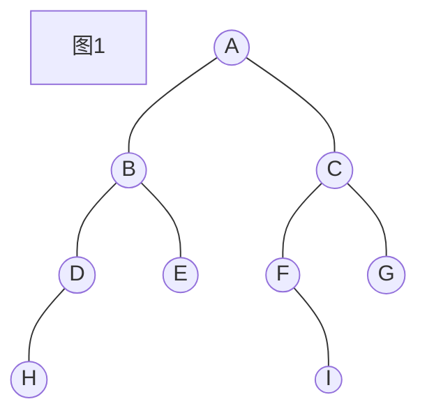

上图就是一副二叉树的图，其中**结点**为`[A, B, C, D, E, F, G, H, I]`

它是组成一颗树的最基本的单元，**就算只有一个结点，也可以称之为一棵树**。

其中最上面的那个结点，我们称之为**根节点(Root)**，整棵树就是由根节点引发的。因此，一棵树一定有一个根节点。

### 1.1.1 子结点(Child Node)

子结点是一个结点的下一级所包含的所有结点，比如说在这张图中

`B`是`A`的子节点，`H`是`B`的子节点，所以`H`也是`A`的子节点，对于子节点来说，包含关系为大的包含小的。

### 1.1.2 孩子结点

和子节点有区别的是，孩子结点是**直接连接到一个结点的子节点**，`B`是`A`的孩子结点，但是`H`不是`A`的孩子结点，`H`是`D`的孩子结点。

对于一棵**二叉树**，来说，由于一个结点最多只能有`2`个孩子结点，所以我们会把一个结点的孩子称为**左孩子**和**右孩子**，在上图中，`D`是`B`的左孩子，`I`是`F`的右孩子，`G`不是`A`的孩子。

### 1.1.3 祖先结点(Ancestor Node)

**祖先结点**是**子节点**相对的概念，只要是包含一个结点的结点都可以称之为被包含结点的祖先节点，在上图中，`A`是`B`的祖先，`B`是`H`的祖先，`A`是`H`的祖先。

### 1.1.4 父亲结点（Parent Node）

**父亲结点**也被称之为**父结点**，是**孩子结点**的相对概念，与一个结点直接相连的祖先结点被称之为该节点的父节点，上图中，`A`是`C`的父节点，`C`是`F`的父节点，但是`A`并不是`I`的父节点。`A`是`I`的祖先结点。

### 1.1.5 兄弟结点 

兄弟结点是位于一棵树中同一层级的结点的称呼。再经过细化可以将兄弟结点分为**兄弟结点**和**堂兄弟结点**。

**兄弟结点**指的是：同一层级，双亲相同的结点。

**堂兄弟结点**指的是：同一层级，双亲不同的结点。

在上图中，`D， E`结点是兄弟结点，他们有共同的父节点`B`。`E, G`结点是堂兄弟结点，他们在二叉树的层级相同，但是`E`的父亲是`B`结点，`G`的父亲是`C`结点。

## 1.2 度(Degree)

从宏观角度来说，度就是边，一个结点有多少条边，就可以称之为这个结点的度为几。

但是度分为两种：**入度(indegree)**和**出度(outdegree)**。但是入度和出度是一个图才需要探讨的内容，在这里老师狭义的把它放到了树当中来为大家解答。

有向图都是有方向的，而树是一种特殊的图，后续大家会学习到，**树是一种无环的连通图**。

而一个有向图中，所有的度都是有方向的，从某一个点，指向某一个点，如果严格的将上图的树画成是图的形式，应该是下面这张图：

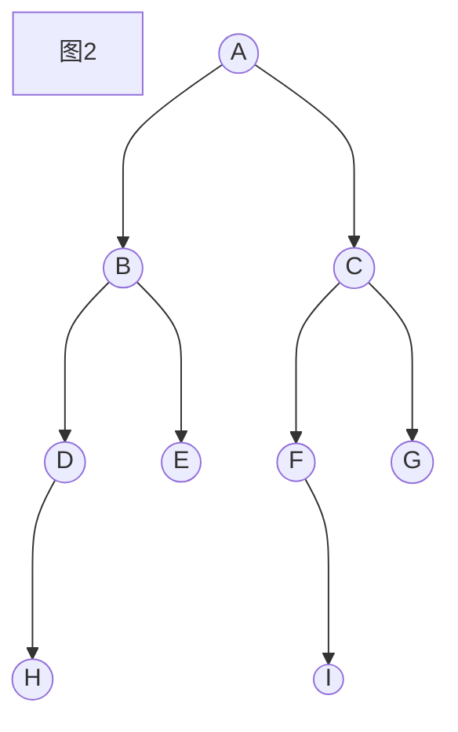

那么，我们把**指向一个结点的度称为入度**，把**结点指出去的度称为出度**，比如说在上图中，结点`B`的入度为`1`，出度为`2`，结点`H`的入度为`1`，出度为`0`，根节点`A`的入度为`0`，出度为`2`。

那么为什么我们说，树是一种特殊的图呢？因为在有向图中，所有的度一定需要标明特别明确的方向，但是在树中，即使不表明方向，我们也会人为的给他定义为，**指向孩子结点的叫做度**，也就是说，在树中，我们只关心，一个结点含有的**孩子节点**，而并不是那么关心它的**父节点**。

所以在二叉树中我们约定俗成有一个规定：

**结点的度指的是结点的出度，不关心结点的入度**，因为一个结点只要存在，除了根节点一定有`1`条入度。

**树中的度虽然没有方向箭头标明，但是树中的度是有方向的，一般是远离根节点的方向。**

比如说上图中`A`就是一个度为`2`的结点。

`D`是一个度为`1`的结点。`H`是一个度为`0`的结点。

### 1.2.1 叶子结点 (Leaf Node)

度为`0`的结点被称之为叶子结点，叶子结点没有孩子结点，上图中共有`4`个叶子结点，分别是`[E, G, H, I]`。

### 1.2.2 K叉树

在一棵树中，我们选取度最多(假设为k)的那个结点，我们称这个**树的度为K**，这棵树称之为**K叉树**。

所以二叉树就是一棵**树的度为2**的树。

所以**二叉树**的概念是：**结点的度最多为`2`的一棵树**

下图就是一颗三叉树，因为`A`的度为`3`，我们也可以说这棵树的度为`3`。

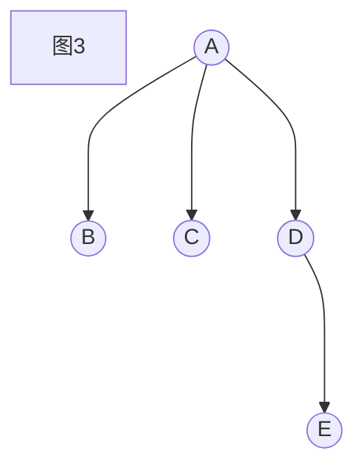


## 1.3 深度 (Depth)

一棵树的深度指的是树中结点的最大层次，比如说一开始的那个图，就是一个深度为`4`的树。

但是每一个结点也可以称呼它的深度，根节点的深度为`1`。所以一个结点的孩子结点的深度就是这个结点的深度`+ 1`。

比如说图1中，结点`B`的深度为`2`，结点`H`的深度为`4`。

## 1.4 森林 (Forest)

由若干个互不相交的树组成的一整个图被称之为一个森林，下图就是由`4`棵树组成的一个森林。

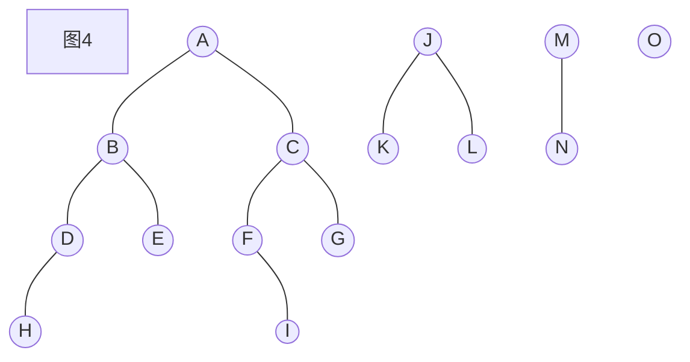

## 1.5 树的遍历(Tree Traversal)

由于树不像**线性结构**的数据结构，如：数组，我们可以通过下标和循环的组合方式完成对树中的结点每一个的搜寻，所以我们需要采取一种**深度优先搜索(Depth-First Search, DFS)**的思想去遍历一个树，`DFS`实现的根本机制是通过递归完成的，顾名思义，深度优先，就是一条路走到黑，如果走到深度不能再深的位置，才会回头的一种盲目搜索算法，为什么要称他为盲目搜索呢？因为它并不考虑结果可能的位置，彻底的搜索整张图，直到找到答案为止。但是即使是盲目搜索，也是要有一定的搜索规范的，为此，我们为一棵树提供了`4`种常用的遍历规则。

### 1.5.1 先(前)序遍历 (Preorder Traversal)

遍历规则为：**根、左、右**

采取的搜索策略如下

① 从根结点开始搜索。

② 如果该结点为空结点则不继续搜索

③ 访问根结点

④ 搜索该结点的左孩子并返回步骤②

⑤ 搜索该结点的右孩子并返回步骤②

所以图1中的树的先序遍历结果为：

`[A, B, D, H, E, C, F, I, G]`

如图5所示，搜索到结点`A`的时候，只关心这样的一棵小树，在这个树中我们需要关心这个树的根节点，左孩子，右孩子。

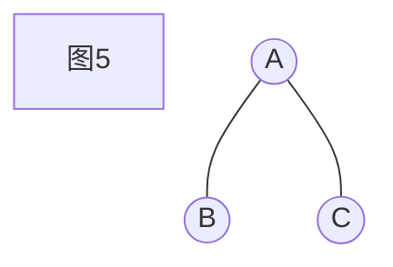

访问完`A`后，搜索这棵树的左孩子，此时我们会得到如图6所示的结果。

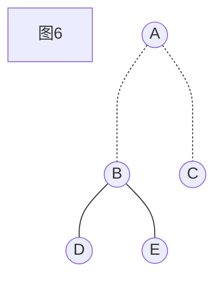

在这课树中，我们同样先访问根节点`B`，然后继续搜索左孩子`D`，以此类推。

先序遍历的递归代码为：

```cpp
struct TreeNode {
    int val;
    TreeNode *left, *right;
};
void preorder(TreeNode* root) {
    if (!root) return;
    cout << root->val << " ";// 访问根节点
    preorder(root->left);    // 左孩子
    preorder(root->right);   // 右孩子
}
int main() {
    TreeNode *root = new TreeNode();
    // 建树
    preorder(root);
}
```


### 1.5.2 中序遍历(Inorder Traversal)

遍历规则为：**左、根、右**

采取的搜索策略如下

① 从根结点开始搜索。

② 如果该结点为空则不继续搜索

③ 搜索该结点的左孩子并返回步骤②

④ 访问根结点

⑤ 搜索该结点的右孩子并返回步骤②

所以图1中的树的先序遍历结果为：

`[H, D, B, E, A, F, I, C, G]`

图5的树中，先访问到以`B`为根节点的一棵树(图6)，此时再遵循这个规则，访问以`D`为根节点的树(图7)。

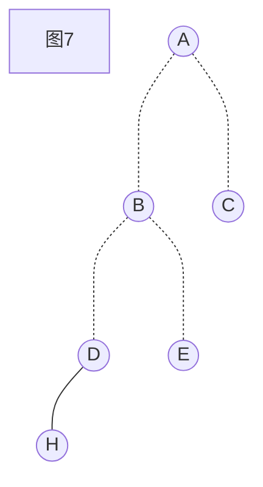

然后访问节点`H`，在这棵树中，再访问根节点`D`,然后访问这棵树的右孩子，发现为空，退出搜索，回到图6的这棵树中以此类推...

中序遍历的递归代码为：

```CPP
struct TreeNode {
    int val;
    TreeNode *left, *right;
};
void inorder(TreeNode* root) {
    if (!root) return;
    inorder(root->left);    // 左孩子
    cout << root->val << " ";// 访问根节点
    inorder(root->right);   // 右孩子
}
int main() {
    TreeNode *root = new TreeNode();
    // 建树
    inorder(root);
}
```


### 1.5.3 后序遍历 (Postorder Traversal)

遍历规则为：**左、右、根**

采取的搜索策略如下

① 从根结点开始搜索。

② 如果该结点为空则不继续搜索

③ 搜索该结点的左孩子并返回步骤②

④ 搜索该结点的右孩子并返回步骤②

⑤ 访问根结点

所以图1中的树的先序遍历结果为：

`[H, D, E, B, I, F, G, C, A]`

后序遍历的递归代码为：

```cpp
struct TreeNode {
    int val;
    TreeNode *left, *right;
};
void postorder(TreeNode* root) {
    if (!root) return;
    postorder(root->left);    // 左孩子
    postorder(root->right);   // 右孩子
    cout << root->val << " ";// 访问根节点
}
int main() {
    TreeNode *root = new TreeNode();
    // 建树
    postorder(root);
}
```

### 1.5.4 层序遍历 (Levelorder Traversal)

二叉树中还有一种极其特殊的遍历规则，叫做层序遍历，这种遍历的规则是，**从上往下，从左往右**地对二叉树进行搜索，它利用到了搜索算法中的另外一种算法：**广度优先搜索(Breadth-First Search, BFS)**，由于BFS需要**队列**的前置知识，在这里就不做过多的展开了，大家只需要知道有这样的思想即可。

图1所示的二叉树的层序遍历结果为`[A, B, C, D, E, F, G, H, I]`。

层序遍历的输出代码为：

对于各位同学目前来说，这段代码已经十分超前了，但是相信在不久后的将来，各位都能够写出这个代码。

```cpp
struct TreeNode {
	int val;
	TreeNode *left, *right;
};
vector<vector<int>> levelorder(TreeNode* root) {
    vector<vector<int>> ans;
    if (!root) return ans;
    queue<TreeNode*> q;
    q.push(root);
    while (q.size()); {
        int n = q.size();
        vector<int> step;
        while (n--) {
            TreeNode* node = q.front(); q.pop();
            step.push_back(node->val);
            if (node->left) q.push(node->left);
            if (node->right) q.push(node->right);
        }
        ans.push_back(step);
    }
    return ans;
}
int main() {
    TreeNode *root = new TreeNode();
    // 建树
    vector<vector<int> > ans = levelorder(root);
    for (auto& st : ans) {
        for (auto& x : st) cout << x << " ";
        cout << endl;
    }
}
```

## 1.6 特殊二叉树

### 1.6.1 满二叉树 (Full Binary Tree)

满二叉树有两种定义方法，意思其实是一样的，按照中国境内对满二叉树的定义如下：

一个二叉树，如果每一个层的结点数都达到最大值，则这个二叉树就是满二叉树。也就是说，如果一个二叉树的深度为$K$，且结点总数是$2^k -1$ ，则它就是满二叉树。

国外对于满二叉树是这么定义的：

`a binary tree T is full if each node is either a leaf or possesses exactly two childnodes.`

翻译过来的意思为：如果一棵二叉树的结点要么是叶子结点，要么它有两个子结点，这样的树就是满二叉树。

同学们可以发现，如果图8这样的树，就是一个满足国外定义的满二叉树

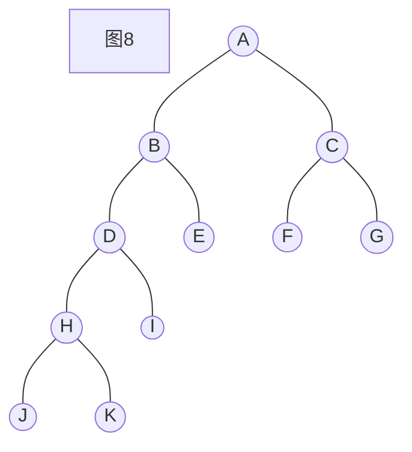

但是经过同学们的学习后，我们需要知道的是，国内的考试中，仅仅会认为，这样的树是一棵普通的二叉树，但是在国外的定义中它就是一个满二叉树，

按照中国计算机协会认证的满二叉树一定是按照下图图9所示的二叉树。

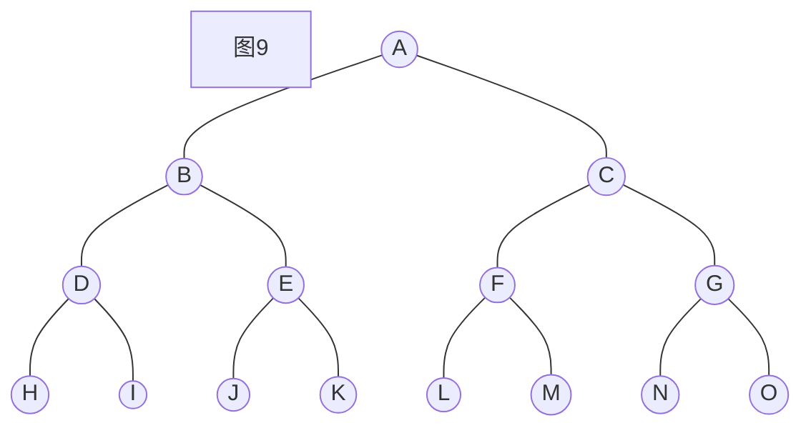


这棵树的深度为`4`，有$2^4 - 1 = 15$个结点，所以它是一棵深度为`4`的满二叉树。一个满二叉树中，我们可以根据它的结点数量计算出它的层数。

### 1.6.2 完全二叉树 (Complete Binary Tree)

一棵深度为$K$的有$n$个结点的二叉树，对树中的结点按照从上往下，从左往右进行编号，如果编号为$1-n$的结点刚好和满二叉树相同，我们则认为这棵树是完全二叉树。

我们可以这么理解一棵完全二叉树：不考虑最后一层，它是一棵满二叉树，最后一层的结点都是从左往右填充的。

下列图10就是一颗完全二叉树。

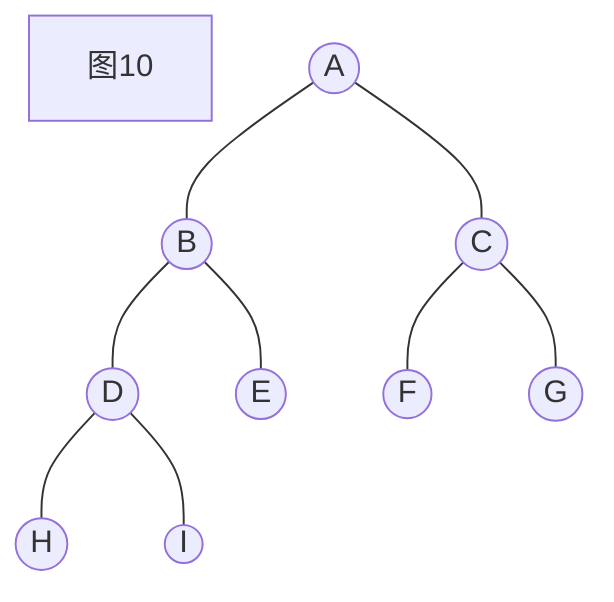


## 1.7 构建二叉树

在题目中，我们常常会遇到这样的问题：给定一个二叉树的中序遍历和先序遍历，或者给定一个二叉树的中序遍历和后序遍历，构建出一个二叉树求另外一种遍历规则。

在这类题目我们要清楚的是：**只给定二叉树的先序遍历和后序遍历，是无法确定一棵二叉树的**

例如给定先序遍历为：`[A, B, C, D]`和后序遍历为`[B, D, C, A]`，我们可以画出两棵树：

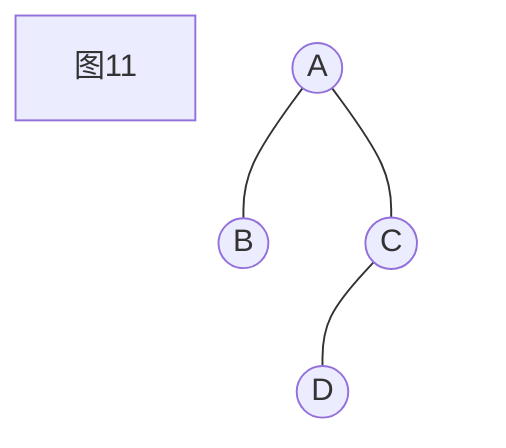

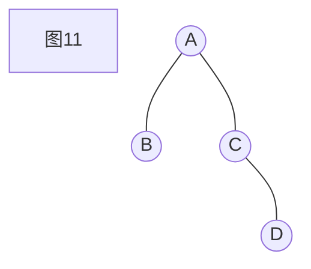

第一棵树的中序遍历结果为`[B, A, D, C]`，第二棵树的中序遍历结果为`[B, A, C, D]`

所以只给定先序和后序是无法确定为同一棵二叉树的。

想要画出这棵二叉树，我们也必须采取递归的思想。

如果是给定中序和后序遍历，我们应按照如下规则来进行

① 检查后序遍历中最后一个没有被划掉的结点，作为上一节点的右孩子，如果目前画的树为空则最后一个结点为根节点。

② 在中序遍历中找到这个结点，将中后序遍历的结点同时划掉。

③ 如果中序遍历刚刚划掉的结点的左边紧挨着的结点没被划掉，则这个结点为左孩子，将中后序遍历同时划去这个结点，返回步骤①。


## 1.8 树与表达式

表达式是一个将数与符号经过一系列排列组合后形成的一个式子，对于人类来说，我们通常情况下使用的均是中缀表达式。例如：

$a * (b + c) * d$

就是一个表达式。

但是同时，我们将这个表达式进行一系列排列组合后，$**a+bcd$也是一个表达式，只不过不符合我们人类的计算顺序而已。

### 1.8.1 中缀表达式

对于刚刚的表达式，如果我们用树将其表示的话，需要按照这个表达式中计算的顺序依次建树，这棵树的中序遍历结果就是中缀表达式。

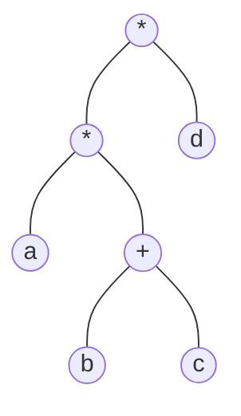

这棵树的中序遍历结果就为$a * (b + c) * d$

### 1.8.2 前缀表达式 (波兰表达式)

将中序表达式建树后，对这棵树先序遍历的结果，就是表达式的前缀表达式，在刚刚的例子中，使用上图的树，我们可以得到前缀表达式为：

$**a+bcd$

前缀表达式也称为波兰表达式，运算符位于操作数之前，我们应该采用栈来存储运算符和操作数，在通过对运算符栈一次出栈1个，对操作数栈一次出栈2个的方式，来对表达式进行求值，这也是计算机中使用最多的表达式存储方式。

例如在上述的前缀表达式中，最先被计算的是

$+bc$ ，然后计算的是$*a$ ，最后计算的是$* d$，按照**先进后出**的栈的操作顺序后，我们就可以得出和$a * (b + c) * d$一样的结果。

### 1.8.3 后缀表达式 (逆波兰表达式)

将中序表达式建树后，对这棵树后序遍历的结果，就是表达式的后缀表达式，在刚刚的例子中，使用上图的树，我们可以得到后缀表达式为：

$abc+*d*$

与前缀表达式相似，只是运算符位于操作数之后，当遍历到运算符时，从操作数栈中弹出两个栈顶元素，进行运算后再放入栈中，直到遍历完整个后缀表达式后就能计算出结果。

