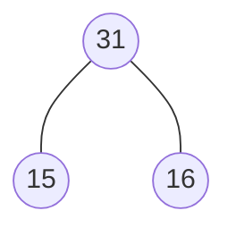
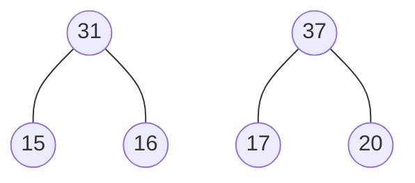
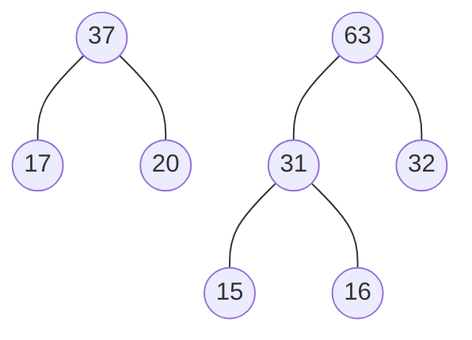
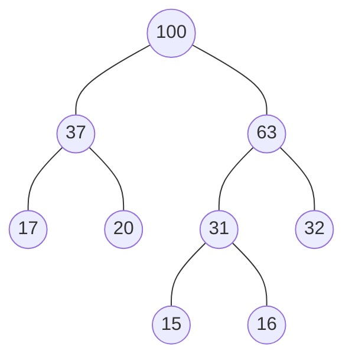
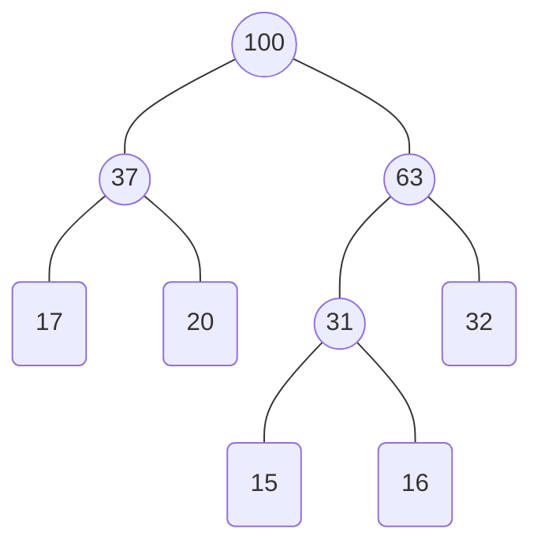
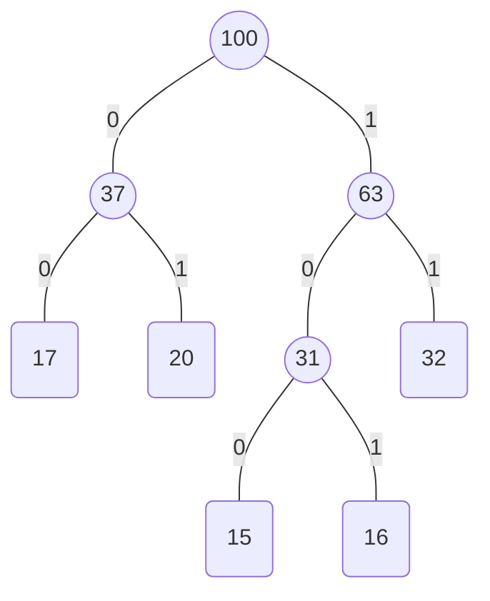

# 信息学奥赛笔记21

哈夫曼编码，哈夫曼树，图

# 哈夫曼树

## 产生

在一篇英文的文章中，大多数情况下，整体内容都是由英文字母和标点符号组成的。那计算机在存储每一个字符的时候采用的存储方式都是一个$ASCII$码的形式，一个$ASCII$码需要使用`8`个二进制位，一个字节，在文章体量极大的情况下，这样存储还是十分的占用计算机内存，于是产生了对**内存压缩**的需求。

比如说：一篇文章仅仅出现`26`个英文字母，那么如果用$ASCII$码的形式存储，其实能存储`128`个字符，但是这篇文章仅仅只使用到了`26`个字符类型，所以咱们用不到那么多的**二进制位**。在刚刚的例子中，一共有`26`种不同的字符编码，那么`5位二进制`就能代表`32`种不同的字母：例如我们给`a`定义为`00000`，给`z`定义为`11010`。

那么，这样编码后，我们遇到一篇文章就可以使用这个新的编码来存储了，比如说，我们想要存储`abcd`这篇文章，如果使用$ASCII$码表来存储，需要使用`32`个二进制位，但是如果采用新的编码存储，只需要使用`20`个二进制位，刚刚的结果是`000000000100001000011`。

如果一篇文章仅仅有`[a, b, c, d, e]`五个字母的话，我们可以用`3`位二进制位来对这篇文章重新编码，`a`为`0`，`b`为`1`，`c`为`10`，`d`为`11`，`e`为`100`。

那如果有如下编码`001001101`，我们可以把这个编码翻译成`aacabcb`也就是`0 0 10 0 1 10 1`，也可以把这个编码翻译成`aaedab`，也就是`0 0 100 11 0 1`，那我们发现采用这种编码形式来压缩文章的话，可能会导致文章的歧义，同一个编码格式可能会导致翻译成不同的文章的情况，这种情况会导致我们压缩后丢失数据，是不利于结果的。

所以由此，我们不仅仅需要缩短每个编码的长度，还需要使得每一个编码是**唯一**的，不会被重复翻译。这样就产生的哈夫曼树。

## 哈夫曼树

为了计算出哈夫曼编码，我们需要先作一棵哈夫曼树

哈夫曼树的求解过程如下。

假设一篇文章有且仅有若干个字符，我们将这些字符的分布频率($字符出现个数 ÷ 文章字符总数 × 100\%$)先求出来，然后排个序。

① 从当前的频率中选出两个最小的频率，将他们求和后重新排放在整体的频率表中。

② 将刚刚的两个频率放进树的兄弟结点中建树。

重复执行①②后直到频率表中没有元素结束。

例题：

一篇文章中一共有`100`个字符，有且仅有`[a, b, c, d, e]`五种字符，在这篇文章中这五种字符分别出现了`[15, 20, 16, 32, 17]`

首先，将这五个字母的频率排列后是`[15, 16, 17, 20, 32]`

选出其中两个最小的结果，将其求和后放回频率表。然后将这两个元素进行建树。

现在的频率表为`[17, 20, 31, 32]`，我们再拿出其中两个最小的结果，此时有几种情况。

+ 两个最小的频率都是原始频率
+ 两个最小的频率其中一个是求和后频率
+ 两个最小频率均是求和后频率

那么我们都需要把他们拿出，求和后放回频率列表中，但是在树里的操作情况是不同的。

对于第一种情况，我们需要在刚刚一层建的树的旁边再建一个兄弟树。

对于第二种情况，我们需要把当前的原始结点和求和后结点作为兄弟结点建树。

对于第三种情况，直接将两个结点作为兄弟结点相连求和。

所以目前的两个最小值`[17, 20]`符合情况`1`。所以这两个结点需要同层建树

现在的频率表为`[31, 32, 37]`，我们拿出其中两个最小的结果，`[31, 32]符合`情况`2`，所以`[32]`需要与`[31]`这个结点同层建树。

现在的频率表为`[37, 63]`，我们拿出其中两个最小的结果，`[37, 63]`符合情况`3`，所以需要直接将结点相连。

上图所示的结果就是一个哈夫曼树了。

## 哈夫曼编码

我们把哈夫曼树的原始频率，也就是对应着每个字符出现的频率的情况把他们单独标记出来

我们把这棵树从跟结点开始，左孩子为`0`，右孩子为`1`的规则，分别遍历到每一个结点，并标记编码

`[a, b, c, d, e]`所对应的编码为`[15, 20, 16, 32, 17]`

我们分别求出他们路径上对应的编码

|  字符   | 频率 | 编码 | 码长 |
| :-----: | :--: | :--: | :--: |
| **$a$** |  15  | 100  |  3   |
| **$b$** |  20  |  01  |  2   |
| **$c$** |  16  | 101  |  3   |
| **$d$** |  32  |  11  |  2   |
| **$e$** |  17  |  00  |  2   |

利用这个编码规则所求出来的新的编码就可以避免**一码两意**的冲突情况发生了。

## 平均码长

平均码长的计算公式为$WPL = 总码长 / 字符个数$

总码长的计算公式为$PL = \Sigma频率 * 码长$

$\Sigma$的意思就是大求和的意思，在这道题中，码长为$15 * 3 + 20 * 2 + 16 * 3 + 32 * 2 + 17 * 2 = 231$

把每个字符的**频率*码长**求出来之后再进行一次求和，就是大求和$\Sigma$。

所以平均码长$WPL = 231 / 100 = 2.31$，平均每个字符只需要占用`2.31`个二进制位就可以存储整个文章，相比于$ASCII$码的存储来说，一共需要$100 * 8 = 800$个二进制位，我们减少了`569`个二进制位，整篇文章就被大大的压缩了。

# 冒泡排序

冒泡排序的规则十分简单，我们需要交换两个相邻的数，如果发现左边比右边大，也就是在一个数组中，我们发现$a[i] > a[i +1]$则进行一次交换，每一趟冒泡排序可以把这一趟最大的值交换到数组的最右端，所以我们可以利用这个原理快速的得出冒泡排序的计算结果。

下表就是一个冒泡排序的交换过程

|   冒泡排序的次数   | a[0]  | a[1]  | a[2]  | a[3]  | a[4]  | 交换次数 |
| :----------------: | :---: | :---: | :---: | :---: | :---: | :------: |
| **初始数组的情况** |   3   |   5   |   4   |   2   |   1   |    0     |
| **第1趟冒泡排序**  |   3   |   4   |   2   |   1   | **5** |    3     |
| **第2趟冒泡排序**  |   3   |   2   |   1   | **4** | **5** |    2     |
| **第3趟冒泡排序**  |   2   |   1   | **3** | **4** | **5** |    2     |
| **第4趟冒泡排序**  |   1   | **2** | **3** | **4** | **5** |    1     |
| **第5趟冒泡排序**  | **1** | **2** | **3** | **4** | **5** |    0     |

所以把数组`[3, 5, 4, 2, 1]`排序成`[1, 2, 3, 4, 5]`一共需要交换$3 + 2 + 2 +1 = 8$次，第$i$趟可以把数组里第$i$大的数放置在正确的位置上。

在上表中，被加粗的数，就表示在这一趟下，已经被放置在正确位置上的数的情况。

所以一个长度为$n$的数组，我们最多需要走$n$趟冒泡排序，每一趟冒泡排序最多会经历$n$次交换，也就是说最坏的情况下，冒泡排序会经历两层循环，一共有$n * n = n ^ 2$次交换才能完成排序，我们也把冒泡排序的时间复杂度称为$O(n^2)$

# 栈

**栈是一种数据结构**

它的根本原理是**先进后出(First-In-Last-Out, FILO)**，下图所示的就是一个栈的结构。

假如说有`3`个元素入栈，分别为`[1, 3, 5]`那么下图就是一个可能得情况。

那现在想要对这个栈出栈的话，就只能先将`5`出栈，但是也有可能在$5$入栈前，$3$已经出栈了，所以这个栈的出栈顺序可以是`[3, 5, 1]`也可以是`[3, 1, 5]`

那么，一个栈如果是以`[1, 3, 5]`的顺序入栈的话，一共有`5`种可能得出栈顺序，他们分别是

`[1, 3, 5]` ： `[1入栈，1出栈，3入栈，3出栈，5入栈，5出栈]`；

`[1, 5, 3]` ： `[1入栈，1出栈，3入栈，5入栈，5出栈，3出栈]`；

`[3, 1, 5]` ： `[1入栈，3入栈，3出栈，1出栈，5入栈，5出栈]`；

`[3, 5, 1]` ： `[1入栈，3入栈，3出栈，5入栈，5出栈，1出栈]`；

`[5, 3, 1]` ： `[1入栈，3入栈，5入栈，5出栈，3出栈，1出栈]`；

但是`[5, 1, 3]`是一个不可能的出栈顺序，因为`5`如果要最先出栈的话，此时栈中一定存储了`[1, 3]`这两个元素，`[1]`不可能比`[3]`优先出栈。

## 卡特兰数

如果有`n`个不同的元素入栈，一共有$\frac{C_{2n}^{n}}{n + 1}$种不同的出栈顺序，这个$\frac{C_{2n}^{n}}{n + 1}$也被称之为是卡特兰数。

在数学上$C_m^n$也被称之为是组合数，从`m`个元素中选取`n`个元素，一共有$C_m^n$种不同的选数方式

具体地，$C_m^n$的公式为:
$$
C_m^n = \frac{n!}{m!(n - m)!} \\
$$
$n!$叫做$n$的阶乘，也就是$n * (n - 1) * (n - 2) *...*1$

所以卡特兰数也写作。
$$
\frac{C_{2n}^n}{n + 1} = \frac{2n!}{n! *n!*(n + 1)} = \frac{2n!}{n!(n + 1)!}
$$
所以在上个例子中，如果有`3`种不同的元素入栈，一共有$\frac{6!}{3!4!}$ = $\frac{720}{144} = 5$种不同的出栈顺序

那如果有`7`种不同的元素入栈，一共有$\frac{14!}{7!8!} = 1716$种不同的出栈顺序。

